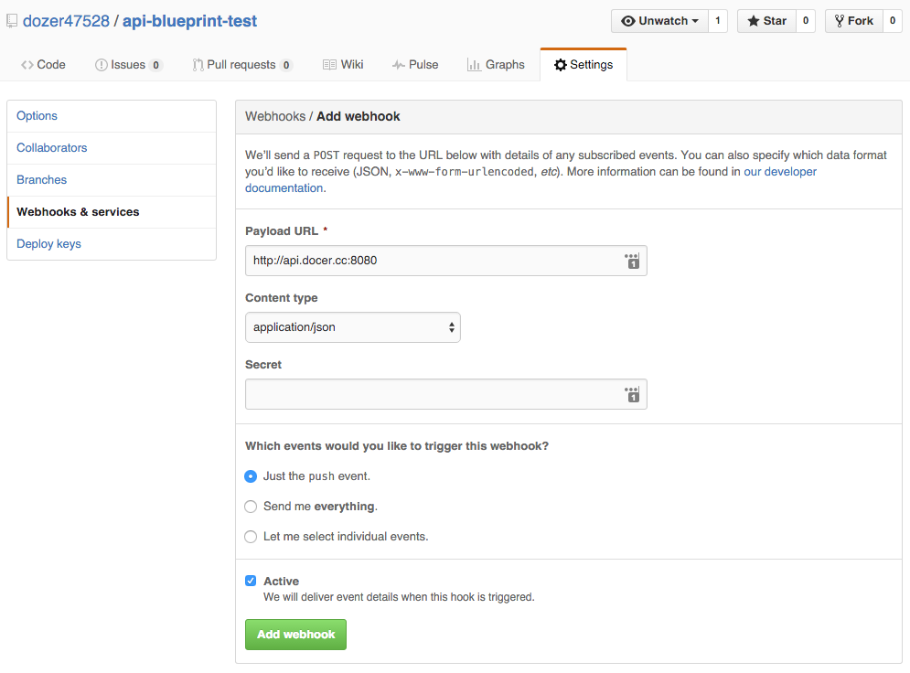

Api Blueprint Docker
=================

[Docker Hub](https://hub.docker.com/r/dozer47528/api-blueprint-docker/)

## How to use?
`docker run --name test -e "repository=https://github.com/dozer47528/api-blueprint-test.git" -p 80:80 -p 8080:8080 -p 3000:3000 -d dozer47528/api-blueprint-docker`

Replace the `https://github.com/dozer47528/api-blueprint-test.git` with your own repository.

Just support `https`, don't use `ssh`, `ssh` need authorization.

&nbsp;

#### Ports explain:

* `80` : document server
* `3000` : mock server
* `8080` : webhook server

&nbsp;

#### How does it work?

When you first run or call the webhook:

1. use `aglio` convert all file like `*.apib` to `*.html`.
2. copy all the files (include origin html file in the repository) to `nginx` root.
3. restart `nginx` (auto reload).
4. restart `drakov` (by script).

&nbsp;

## How to config auto deploy
Add webhook in your repository settings

&nbsp;

## What's next?

&nbsp;

* Support private repository
* Support customize aglio style
* Add webhook secret check
